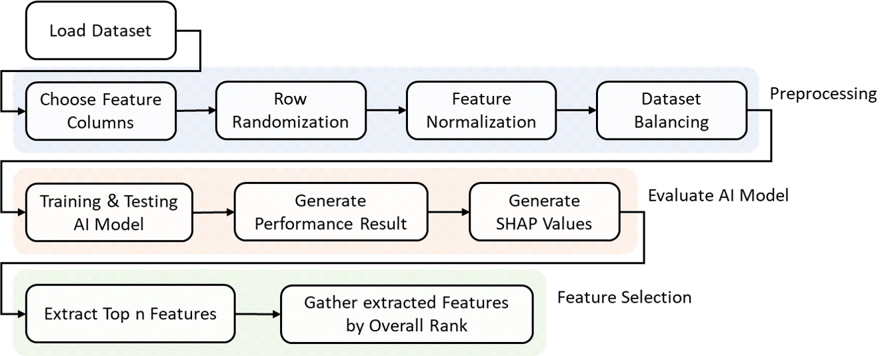
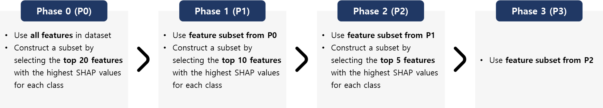

# SHAP-Based Feature Reduction for IDS

This repository presents an analysis of feature importance in Intrusion Detection Systems (IDS) using SHAP (SHapley Additive exPlanation). The goal is to investigate whether all features are necessary for effective attack detection and how feature reduction impacts model performance.

---

## 📖 Overview

With the increasing complexity of network environments and cyber attacks, AI-based IDS models such as Random Forest, Decision Tree, and Neural Networks are widely used.

However, two major challenges remain:

- Lack of interpretability (black-box models)
- High computational cost due to large feature sets

To address these issues, this project applies SHAP-based feature importance to perform **step-wise feature reduction** and analyze its impact on detection performance.

---

## 🎯 Research Questions

- **RQ1**: Can IDS maintain or improve detection performance after feature reduction?
- **RQ2**: How does feature reduction affect minority attack classes?

---

## 🧪 Methodology

The experiment consists of the following steps:

1. Data preprocessing (normalization & balancing)
2. Model training and evaluation
3. SHAP value computation
4. Feature selection based on importance
5. Iterative feature reduction

Feature reduction is performed in phases:

- **P0**: All features
- **P1**: Top-20 features per class
- **P2**: Top-10 features per class
- **P3**: Top-5 features per class

---

## 📊 Datasets

- KDD99
- UNSW-NB15
- CIC-IDS2018
- InSDN :contentReference[oaicite:0]{index=0}  

---

## 🤖 Models Used

- Random Forest (RF)
- Decision Tree (DT)
- Support Vector Machine (SVM)
- Convolutional Neural Network (CNN)
- Artificial Neural Network (ANN)
- K-Nearest Neighbors (KNN)

---

## 📈 Key Findings

- Tree-based models (RF, DT) maintain or even improve performance after feature reduction
- Neural network-based models (CNN, ANN) show performance degradation
- Overall accuracy may remain stable, but **class-level performance can vary significantly**
- Some minority classes suffer from feature removal

> Feature reduction does not necessarily degrade IDS performance — in some cases, it improves efficiency and generalization :contentReference[oaicite:1]{index=1}

---

## 🛠 Environment

- Python: **3.11.14**
- Package management: Conda / Pip

### 주요 라이브러리
- numpy
- pandas
- scikit-learn
- tensorflow
- shap
- matplotlib
- seaborn :contentReference[oaicite:2]{index=2}  

전체 패키지는 아래 파일 참고:
